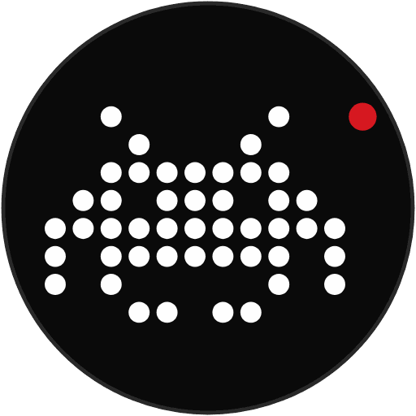

<p align="center"></p>

<h1 align="center">Glyphies</h1>

<p align="center">Games, animations and an editor for the <b>Glyph Matrix</b> on the back of the Nothing Phone (4a) Pro (and Phone (3)). Styled after Nothing OS: dot-matrix type, black or paper, one red accent.<br>
<b><a href="https://github.com/kream0/glyphies/releases/latest/download/glyphies.apk">Download the latest APK</a></b> · Android 8.0+ · <a href="https://kream0.github.io/glyphies/">Website</a></p>

Everything you start lights up the 137 LEDs on the back of the (4a) Pro (the 489 of the Phone (3)), and plays on the screen at the same time. On a phone without a Glyph Matrix, the app is a preview: everything runs on the screen.

Three tabs:

- **Home:** what you played last as a big live matrix with *Play*, then every game and animation (built in and yours) as tiles that play a live preview of themselves. Filter with `ALL / GAMES / ANIMATIONS / MINE`. Tap a tile to play it; long-press it (or ⋯) to edit, rename, duplicate, show it face down or delete. *Settings → Appearance → Live tiles* switches the previews to still pictures.
- **Editor:** reopens what you were working on. Its gallery (tap the grid icon, or the tab again) starts a drawing, an animation, a scrolling text or a game (each template is a tile playing a demo of itself) and lists your creations.
- **Settings.**

## Play

- **Sand:** grains of sand follow the tilt of the phone, with real physics (each grain has a speed, bounces, and piles roll off at 45° like real sand). Shake to throw them about; volume + / − (or + / − on screen) adds or removes sand.
- **Hourglass:** a real timer (30 s, 1, 3, 5 or 10 min). One grain passes the neck at a time; turn the phone over and it runs back, lay it on its side and it pauses. It vibrates when the time is up.
- **Clock:** an analog clock: hour marks on the rim (brighter at 12, 3, 6, 9), anti-aliased hour and minute hands, and the seconds going round the rim (tap to hide them). It's what the back shows face down by default.
- **Invaders:** Space Invaders on the back of the phone. Tilt to slide the ship, it fires on its own (or on a tap / volume key: *Settings → Controls*). The formation marches, bounces off the round edge and comes down; a UFO crosses now and then; every fourth wave is a boss. Lives are the dim dots on the bottom row, hits vibrate, and the best score is kept.

## Create

In the **Editor** tab (the samples show each idea):

- **Draw** dot by dot: pen, eraser, fill, move, mirror, four brightness levels, undo / redo. Tapping a lit dot turns it off. What you draw lights up on the back while you draw (*Show while drawing*).
- **Animate** with frames: a strip of frames, duplicate / reorder / delete, onion skin, 1–30 frames per second, loop, bounce or once. *Scrolling text* makes the frames for you.
- **Make it react to the phone** (*Driven by*): the clock, your **voice** (louder = later frame: a talking mouth), **tilt** left–right or forward–back (an eye that looks around), the **compass** (an arrow that keeps pointing north), the **light**, a **hand** over the screen (proximity), a **shake**, a **tap** or a **clap**. Or **Sand**: shake and the drawing crumbles into sand that follows the tilt; tap to rebuild it.
- **Games** from templates, with your own pictures (drawn in a small sprite editor) and your own controls:
  - **Shooter:** Space Invaders with your ship and invaders.
  - **Dodge:** things fall, stay out of their way.
  - **Catch:** catch what falls, avoid the (dimmer) bombs.
  - **Maze:** tilt to roll a ball to the blinking goal; each frame is a level with walls, a start, a goal and traps.
  - **Fly:** stay between the pipes; flap with a tap, a clap, a shake, or fly with your voice.
  - **Bricks:** breakout; each frame is a level whose lit dots are bricks.
  
  Move with **tilt**, a **finger** (it works behind the phone too) or your **voice** (quiet = left, loud = right); fire / flap / launch with **auto**, **tap**, **clap**, **shake** or **voice**; speed and lives.
- Every creation has a ⋯ menu: play, rename, duplicate, delete, and **Show face down**.

## Glyph Matrix

- **Face down, instead of Nothing's clock:** ⋯ → *Show face down* on the clock, sand, the hourglass or any of your drawings and animations (or *Settings → Glyph Matrix → Face down*) puts it on the back for when the app is closed. The analog clock until you pick something else.
  - **Phone (4a) Pro:** choose Glyphies once in *Settings → Glyph Interface → Flip to Glyph → Always-on Glyph Toy*; then it shows whenever the phone lies face down. Sand reads the tilt when Android lets a toy use the accelerometer; lying flat it gets a slow sway so it keeps flowing. The hourglass turns itself over a few seconds after it runs out.
  - **Phone (3):** add *Glyphies* to the Glyph Button carousel; a long press restarts it.
- While the app is open, games and animations use the app channel of the matrix.
- **Which way is left:** by default the controls follow what you see on the back of the phone (from behind, the screen's left is your right). If you'd rather look at the screen: *Settings → Controls → You look at → Screen*.
- **Volume keys** are buttons while something plays (fire, flap, more / less sand); turn that off in *Settings → Controls*.
- *Settings → Glyph Matrix* has the brightness (with the app open, and face down: face down Nothing dims the matrix, so that one uses the LEDs' full power), an on/off switch, a test, and status lines (service found, connected, accepted, frames sent) that explain a dark matrix.
- The app targets Android 16 because Nothing's Glyph service only waives its API key for apps that do. Nothing's Glyph SDK is closed source and can't be redistributed, so it isn't in this repo: the build downloads it from [Nothing's Glyph-Developer-Kit](https://github.com/Nothing-Developer-Programme/Glyph-Developer-Kit) at a pinned commit and checks its SHA-256.

## Languages and themes

French by default, English in *Settings → Appearance → Language*. Each text is written in both languages where it's used (`tr("Play", "Jouer")`, see `L10n.kt`). Black like Nothing OS or warm paper with black ink (`SYSTEM / DARK / PAPER`).

## Privacy

No account, no ads, no analytics. The microphone (only asked for by things that react to your voice) is used to measure loudness 50 times a second; nothing is recorded, stored or sent. The only network call is the update check on GitHub.

## Updates

The app follows **published releases** (not every push). Every time you open it, it looks at the repo's latest release. If that version is newer, it downloads the APK in the background, checks the SHA-256 against the `version.json` published with the release, and asks whether to install. Android then shows its own confirmation. The first time, it asks you to let Glyphies install apps. Pre-releases are ignored. You can also check by hand in *Settings → Updates*, or turn off auto-download.

## Install

**https://github.com/kream0/glyphies/releases/latest/download/glyphies.apk**

Open that link on your phone, allow "install unknown apps" for your browser, then install. After that the app updates itself from new releases. Requires Android 8.0 or newer; the Glyph Matrix needs a Nothing Phone (4a) Pro or Phone (3) on Android 14+.

## Releasing

Each of these builds the APK and attaches `glyphies.apk` + `version.json` to the release:

- **Bump `VERSION`:** set the file to e.g. `0.2.0` and push. If `v0.2.0` isn't released yet, CI tags that commit and publishes the release.
- **GitHub UI:** *Releases → Draft a new release*, create a tag like `v0.2.0`, then publish.
- **Git:** `git tag v0.2.0 && git push origin v0.2.0`.
- **Actions tab:** run the *Build APK* workflow by hand and enter `0.2.0`.

Tags must look like `vMAJOR.MINOR.PATCH`; the Android versionCode is derived from it (`v1.2.3` → `1002003`). Pushes to branches only build a test APK (in the workflow run's artifacts). It installs as `0.dev.<run>`, and any release updates it.

## Signing

Without any configuration, CI signs builds with the **public dev key** in `keystore/glyphies-dev.jks`. That keeps updates installable, but anyone could sign an APK with it. To use a private key, add these repository secrets:

```
keytool -genkeypair -keystore glyphies.jks -alias glyphies -keyalg RSA -keysize 2048 -validity 36500
base64 -w0 glyphies.jks   # → KEYSTORE_BASE64
```

`KEYSTORE_BASE64`, `KEYSTORE_PASSWORD`, `KEY_ALIAS`, `KEY_PASSWORD`. Android refuses to update across signing keys, so uninstall the dev-key build once when you switch.

## How it works

| Piece | Where |
| --- | --- |
| Matrix layouts (137 / 489 LEDs), frames | `glyph/MatrixShape.kt` |
| Link to Nothing's Glyph service (app channel, toy, test, diagnostics) | `glyph/GlyphLink.kt`, `GlyphSession.kt`, `GlyphOutput.kt`, `ToyService.kt` |
| Sand physics (after Adafruit's PixelDust, plus a 45° avalanche rule) | `engine/SandSim.kt`, `engine/SandToys.kt` |
| Invaders and the game templates | `engine/Invaders.kt`, `Falling.kt`, `Maze.kt`, `Fly.kt`, `Bricks.kt` |
| Animations and their sensor drivers | `engine/Animation.kt` |
| Sensors: gravity, shakes, microphone loudness / claps, light, proximity, compass, volume keys | `sense/Sensors.kt` |
| Game loop: input → update → frame → matrix + screen | `play/Player.kt` |
| Creations (frames as hex, sprites, game settings) and samples | `data/Creation.kt`, `CreationStore.kt`, `Seeds.kt` |
| UI | Jetpack Compose, fonts Doto, Space Grotesk and Space Mono (OFL) |
| Website | `docs/` (one HTML page with live demos), published to GitHub Pages by the *Site* workflow |

The engines (`engine/`, `glyph/MatrixShape.kt`, `glyph/DotText.kt`) are plain Kotlin with no Android dependency, so they can be run and tested on a desktop JVM.

## Build locally

JDK 17 plus the Android SDK (compileSdk 36):

```
./gradlew assembleRelease     # → app/build/outputs/apk/release/app-release.apk
```

Glyphies isn't affiliated with Nothing.
